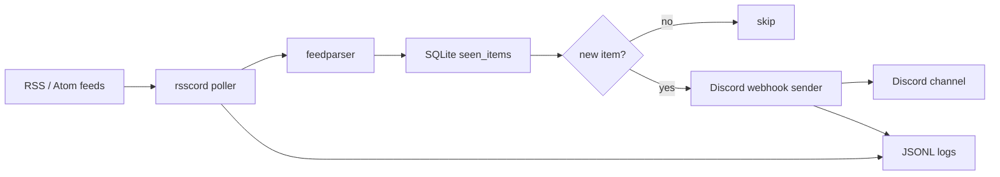

# Operations

This document describes runtime behavior, state, logs, and failure handling.

---

## How it works



Core loop:

1. Load `config.yaml`.
2. Fetch enabled feeds.
3. Parse RSS/Atom entries.
4. Compute stable item ID.
5. Check SQLite state.
6. Send unseen items to Discord.
7. Mark successfully sent items as seen.
8. Log important events as JSONL.

---

## CLI reference

```bash
uv run rsscord.py --help
```

| Flag                     | Description                                                  |
| ------------------------ | ------------------------------------------------------------ |
| `--config PATH`          | YAML config path. Defaults to `config.yaml`.                 |
| `--once`                 | Poll once and exit.                                          |
| `--dry-run`              | Do not send Discord messages and do not mutate SQLite state. |
| `--print-example-config` | Print sample YAML config to stdout.                          |
| `--validate-config`      | Load config, validate it, log summary, and exit.             |

Examples:

```bash
uv run rsscord.py --print-example-config > config.yaml
uv run rsscord.py --config config.yaml --validate-config
uv run rsscord.py --config config.yaml --once --dry-run
uv run rsscord.py --config config.yaml --once
uv run rsscord.py --config config.yaml
```

---

## State and dedupe

SQLite state stores seen feed items.

Local default:

```yaml
state:
  sqlite_path: "./rsscord_state.sqlite3"
```

Docker recommended path:

```yaml
state:
  sqlite_path: "/data/rsscord_state.sqlite3"
```

Delete this file to reset dedupe history.

Item identity is derived from stable feed entry fields such as feed URL, entry ID/GUID/link/title/timestamp fallback. RSS feed quality varies, so some feeds may still produce occasional duplicate-looking entries.

---

## Logs

Runtime logs are JSONL. Each line is one JSON object.

Example events:

```jsonl
{"event":"daemon_started","feed_count":2,"interval_seconds":300,"jitter_seconds":15,"level":"INFO","ts":"2026-05-12T00:00:00+00:00"}
{"event":"feed_checked","feed_name":"Hacker News frontpage","item_count":30,"level":"INFO","ts":"2026-05-12T00:00:01+00:00"}
{"event":"discord_send_success","feed_name":"Hacker News frontpage","status_code":204,"level":"INFO","ts":"2026-05-12T00:00:02+00:00"}
```

Useful commands:

```bash
cat rsscord.log.jsonl
jq -r 'select(.event == "discord_send_success") | [.ts, .feed_name, .title] | @tsv' rsscord.log.jsonl
jq -r 'select(.level == "ERROR" or .level == "WARNING")' rsscord.log.jsonl
```

---

## Failure model

| Failure                 | Behavior                                     |
| ----------------------- | -------------------------------------------- |
| Feed fetch error        | Log error, continue with next feed.          |
| Feed parse warning      | Log warning, attempt to continue.            |
| Discord `429`           | Retry using `retry_after` when available.    |
| Discord send failure    | Leave item unseen so next poll can retry.    |
| Successful Discord send | Mark item as seen in SQLite.                 |
| Dry run                 | Send nothing and do not mutate SQLite state. |

A failed Discord send should not silently drop an item.